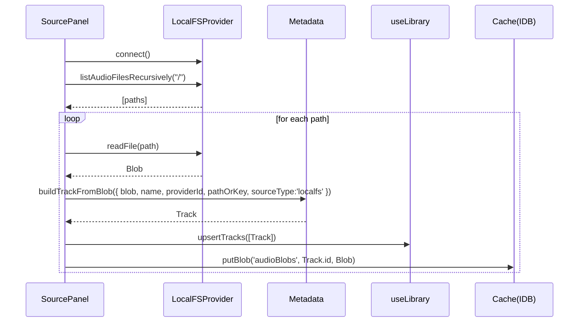
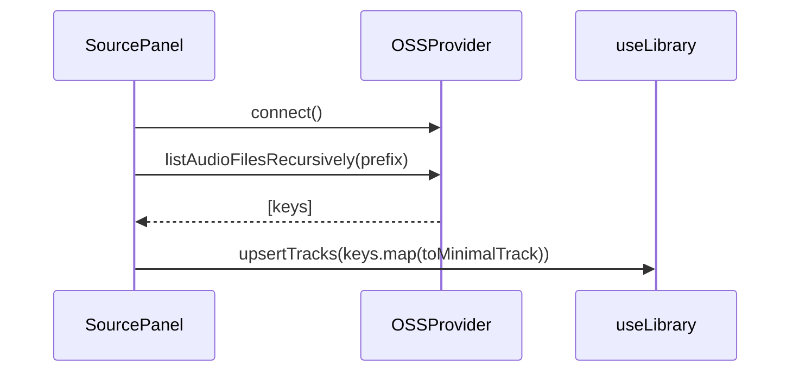
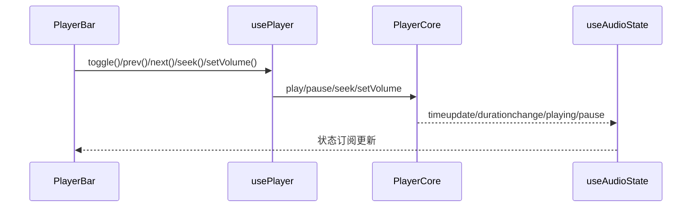
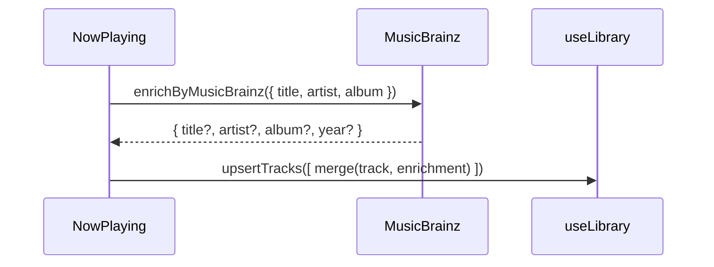
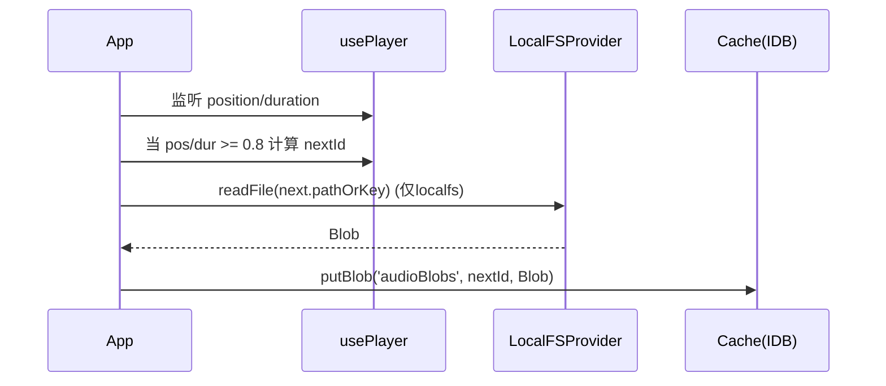
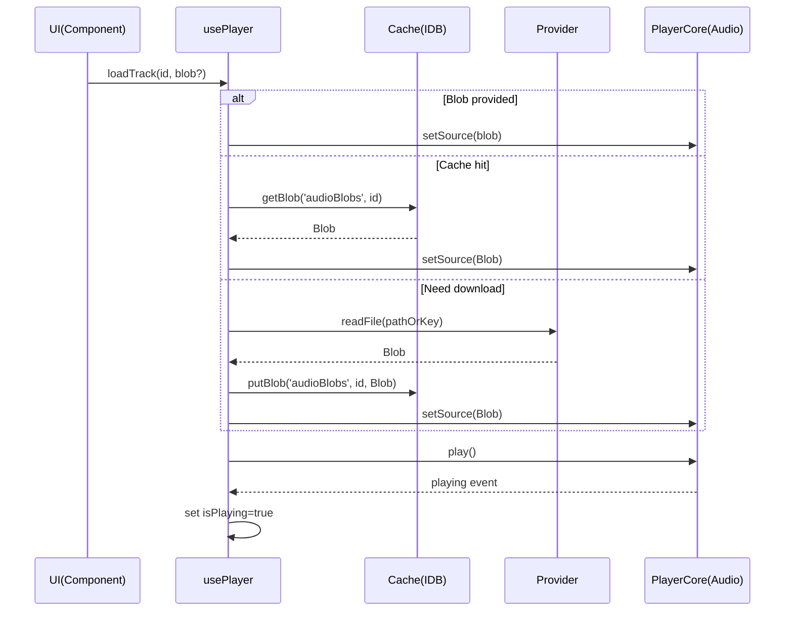

# Web 音乐播放器 开发文档

## 目录
- 项目概览
- 1. 模块功能说明
  - 1.1 Providers（音源提供方）
  - 1.2 Services（通用服务）
  - 1.3 Stores（状态管理）
  - 1.4 Components（界面组件）
  - 1.5 Utils（工具）
- 2. 模块关系图
- 3. 函数接口规范
- 4. 实现细节
  - 4.1 技术选型说明
  - 4.2 核心算法流程图
  - 4.3 重要数据结构定义
  - 4.4 性能考虑与优化策略
- 5. 快速查阅指南
  - 5.1 按功能分类索引
  - 5.2 常见问题解答（FAQ）
  - 5.3 典型使用场景示例

---

## 项目概览
- 技术栈：React 18、Vite 5、TypeScript 5、Zustand 4、idb、react-window、music-metadata-browser、ali-oss、cos-js-sdk-v5
- 目录结构：
  - src/components：UI 功能组件
  - src/providers：音源 Provider 抽象与实现
  - src/services：音频、缓存、元数据等通用服务
  - src/stores：播放器、曲库、歌单、设置等状态
  - src/utils：通用工具函数
  - src/App.tsx、src/main.tsx：应用入口与整体布局
- 运行脚本：
  - 开发：`npm run dev`
  - 构建：`npm run build`
  - 预览：`npm run preview`

---

## 1. 模块功能说明

### 1.1 Providers（音源提供方）
- 统一类型与接口定义（`SourceProvider`）：`src/providers/types.ts:52-59`
- 本地文件系统 LocalFS：递归扫描、读取音频、构建 Track
  - 递归：`walk`（`src/providers/localfs.ts:4-13`）
  - 过滤：`isAudio`（`src/providers/localfs.ts:15-18`）
  - 读取：`readFile`（`src/providers/localfs.ts:40-50`）
  - 扫描构建：`scanLocalFSTracks`（`src/providers/localfs.ts:54-69`）
- 云存储适配：
  - Dropbox（`src/providers/dropbox.ts:12-24, 26-59`）
  - 阿里云 OSS（`src/providers/oss.ts:10-24, 30-49`）
  - 腾讯云 COS（`src/providers/cos.ts:10-25, 31-52`）
  - 自定义 REST API（`src/providers/custom.ts:3-22`）
- Provider 注册与获取：`src/providers/registry.ts:3-6`

输入/输出与处理流程：
- 输入：连接参数、根路径
- 输出：音频路径集合、Blob 音频数据
- 处理：过滤扩展名、分页/递归列举、签名下载 URL（云端）

### 关键算法与优化点
- 异步生成器递归目录（LocalFS）
- 列表分页遍历（云端：OSS/COS/Dropbox）
- 提前扩展名过滤减少开销
- 直连签名 URL 下载提升吞吐

### 1.2 Services（通用服务）
- 音频播放核心 PlayerCore：`src/services/audio/PlayerCore.ts:28-39, 41-47, 48-63`
- 元数据解析与增强：
  - `buildTrackFromBlob`（`src/services/metadata/metadata.ts:21-78`）
  - `enrichByMusicBrainz`（`src/services/metadata/musicbrainz.ts:1-18`）
- 本地缓存 IndexedDB（`idb`）：`src/services/cache/indexeddb.ts:20-37`

### 1.3 Stores（状态管理）
- 播放器 `usePlayer`：`src/stores/player.ts:23-96`
- 曲库 `useLibrary`：`src/stores/library.ts:14-26`
- 歌单 `usePlaylists`：`src/stores/playlists.ts:22-69`
- 设置 `useSettings`：`src/stores/settings.ts:44-51`

### 1.4 Components（界面组件）
- SourcePanel：`src/components/SourcePanel.tsx:12-165`
- PlaylistPanel：`src/components/PlaylistPanel.tsx:4-58`
- NowPlaying：`src/components/NowPlaying.tsx:6-45`
- PlayerBar：`src/components/PlayerBar.tsx:6-47`
- App：`src/App.tsx:13-135`

### 1.5 Utils（工具）
- `formatTime`：`src/utils/time.ts:1-6`

---

## 2. 模块关系图

### 组件与服务交互（Mermaid）
```mermaid
flowchart LR
  A[SourcePanel] -->|registerProvider + list + readFile| P[Providers]
  P --> M[Metadata.buildTrackFromBlob]
  M --> L[useLibrary.upsertTracks]
  A --> C[Cache.putBlob]
  A --> Q[usePlayer.setQueue]
  B[PlayerBar] --> S[usePlayer.* actions]
  S --> Core[PlayerCore (HTMLAudio)]
  Core --> AS[useAudioState]
  N[NowPlaying] --> MBZ[enrichByMusicBrainz]
  N --> L
  App --> L
  App --> S
  App --> C
  App --> AS
```

### 类图（Mermaid UML + 细化）
```mermaid
classDiagram
  class Track {
    +id: string
    +title: string
    +artist: string
    +album: string
    +albumArtist?: string
    +trackNo?: number
    +discNo?: number
    +duration?: number
    +year?: number
    +genres?: string[]
    +cover?: string
    +format: 'mp3'|'wav'|'flac'|'aac'|'ogg'|'unknown'
    +bitrate?: number
    +sampleRate?: number
    +channels?: number
    +sourceType: 'localfs'|'custom'
    +sourceRef: { providerId: string, pathOrKey: string, url?: string }
  }

  class Playlist {
    +id: string
    +name: string
    +trackIds: string[]
    +createdAt: number
    +updatedAt: number
  }

  class PlaybackState {
    +currentTrackId?: string
    +isPlaying: boolean
    +volume: number
    +muted: boolean
    +position: number
    +repeatMode: 'off'|'one'|'all'
    +shuffle: boolean
    +queue: string[]
  }

  class SourceProvider {
    +id: string
    +type: 'localfs'|'custom'
    +name: string
    +connect(): Promise<void>
    +listAudioFilesRecursively(root: string): Promise<string[]>
    +readFile(path: string): Promise<Blob>
  }

  class LocalFSProvider
  class OSSProvider
  class COSProvider
  class DropboxProvider
  class CustomProvider

  LocalFSProvider ..|> SourceProvider
  OSSProvider ..|> SourceProvider
  COSProvider ..|> SourceProvider
  DropboxProvider ..|> SourceProvider
  CustomProvider ..|> SourceProvider
```

### 序列图（更详细）
- 本地导入与构建 Track


- 云端导入（以 OSS 为例）


- 播放控制与状态同步


- 自动补全元数据


- 队列下一首预取（本地）


---

## 3. 函数接口规范
（选取关键公开函数；更多详见源码位置标注）

### Providers
- `registerProvider(p)`（`src/providers/registry.ts:5`）
- `getProvider(id)`（`src/providers/registry.ts:6`）
- `createLocalFSProvider()`（`src/providers/localfs.ts:20-52`）
- `scanLocalFSTracks(provider)`（`src/providers/localfs.ts:54-69`）
- `createDropboxProvider()`（`src/providers/dropbox.ts:26-59`）
- `createOSSProvider()`（`src/providers/oss.ts:10-51`）
- `createCOSProvider()`（`src/providers/cos.ts:10-53`）
- `createCustomProvider(baseUrl)`（`src/providers/custom.ts:3-22`）

### Services
- PlayerCore 控制：`setSource`、`play`、`pause`、`toggle`、`seek`、`setVolume`、`setMuted`、`getBufferedEnd`（`src/services/audio/PlayerCore.ts:48-63`）
- `useAudioState`（`src/services/audio/PlayerCore.ts:41`）
- 元数据：`buildTrackFromBlob`（`src/services/metadata/metadata.ts:21-78`）、`enrichByMusicBrainz`（`src/services/metadata/musicbrainz.ts:1-18`）
- 缓存：`putBlob/getBlob`、`putJSON/getJSON`（`src/services/cache/indexeddb.ts:20-37`）

### Stores
- `usePlayer` 公开动作（`src/stores/player.ts:23-96`）：
  - `loadTrack(id, blob?)`、`loadTrackWithoutPlay(id, blob?)`、`toggle()`、`next()`、`prev()`、`setVolume(v)`、`setMuted(m)`、`seek(pos)`、`setQueue(ids)`、`setRepeat(m)`、`setShuffle(s)`
- `useLibrary.upsertTracks(items)`（`src/stores/library.ts:14-26`）
- `usePlaylists`（`src/stores/playlists.ts:22-69`）：创建、重命名、删除、增删、重排、设当前、导入
- `useSettings`（`src/stores/settings.ts:44-51`）：`updateDropbox/OSS/COS`

### Utils
- `formatTime(sec)`（`src/utils/time.ts:1-6`）

### 使用示例
- 本地导入并播放第一首
```ts
const local = createLocalFSProvider()
await local.connect()
const items = await scanLocalFSTracks(local)
useLibrary.getState().upsertTracks(items.map(i => i.track))
await putBlob('audioBlobs', items[0].track.id, items[0].blob)
usePlayer.getState().setQueue(items.map(i => i.track.id))
await usePlayer.getState().loadTrack(items[0].track.id, items[0].blob)
```

- 通过 OSS 扫描并加入队列
```ts
const oss = createOSSProvider()
await oss.connect()
registerProvider(oss)
const files = await oss.listAudioFilesRecursively('/')
const tracks = files.map(p => ({
  id: `${oss.id}:${p}`,
  title: p.split('/').pop() || 'audio',
  artist: '',
  album: '',
  format: 'unknown',
  sourceType: 'custom',
  sourceRef: { providerId: oss.id, pathOrKey: p }
}))
useLibrary.getState().upsertTracks(tracks as any)
usePlayer.getState().setQueue(tracks.map(t => t.id))
```

---

## 4. 实现细节

### 4.1 技术选型说明
- React + Vite：开发与构建效率高
- Zustand：轻量、可持久化
- react-window：长列表性能优化
- idb：IndexedDB 封装，统一 Blob/JSON 缓存
- music-metadata-browser：音频标签解析
- ali-oss、cos-js-sdk-v5：云存储访问

### 4.2 核心算法流程图
- 加载并播放曲目


- 队列下一首预取（见上）

### 4.3 重要数据结构定义
- `Track`、`Playlist`、`PlaybackState`、`SourceProvider`（详见 2. 类图与源码位置）

### 4.4 性能考虑与优化策略
- 列表虚拟化减少渲染
- Blob 缓存避免重复下载
- 预取下一首提升切歌体验
- 事件驱动降低轮询
- 云端分页提高清单获取稳定性

> 重要：云端访问请使用临时凭证（STS），避免在前端硬编码长期密钥；不要将密钥写入仓库。

---

## 5. 快速查阅指南

### 5.1 按功能分类索引
- 音源接入：`localfs/dropbox/oss/cos/custom`
- 播放控制：`PlayerCore` 与 `usePlayer`
- 元数据：`metadata.ts` 与 `musicbrainz.ts`
- 缓存：`indexeddb.ts`
- 组件：`SourcePanel/PlaylistPanel/NowPlaying/PlayerBar/App`

### 5.2 常见问题解答（FAQ）
- 播放失败：可能触发浏览器自动播放限制，需用户交互
- 本地扫描无响应：需授权目录访问并使用支持 FS Access 的浏览器
- 云存储读取错误：检查 region/bucket/STS 或 token 有效期
- 元数据缺失：音频不含标签或外部服务未命中

### 5.3 典型使用场景示例
- 导入本地文件夹并开始播放（见 3. 使用示例）
- 从 Dropbox/OSS/COS 导入并构建曲库（见 3. 使用示例）

---

